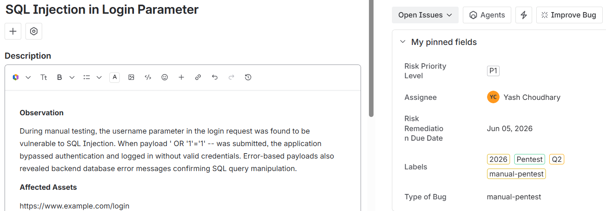

# Pentest2Jira

Simple Python automation to create Jira issues from pentest findings stored in Excel files.

---

## Why this exists

During a penetration test, I had to manually raise around 30+ Jira issues from an Excel sheet. While the testing itself is interesting, the repetitive work of copying findings from Excel into Jira adds unnecessary overhead.

This tool was built to automate that part — converting structured Excel findings directly into Jira tickets so the focus stays on the actual pentesting work rather than documentation overhead.

---

## Features

- Read findings from `.xlsx`
- Create Jira issues automatically
- Configurable Jira custom field mappings
- Lightweight and easy to modify

---

## Expected Excel Format

| S.No. | Finding | Observation | Severity | Affected Endpoint | Impact | Recommendation | Bug Type |
|-------|----------|-------------|----------|-------------------|--------|----------------|----------|

---

## Configuration (at top of script)

Update the variables in the script before running:

---

## Usage

```bash
python Pentest2Jira.py
```

---

## Notes

- Jira custom fields differ across organizations
- Keep credentials secure
- Remove sensitive data before sharing

---

## Jira Sample Ticket



---
## License

MIT
